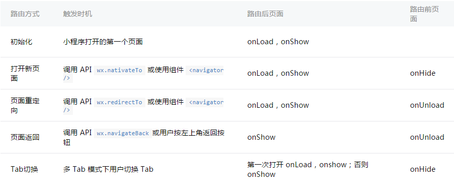

##框架级别
小程序框架并非运行在我们浏览器中，所以浏览器提供的DOM API是无法使用的，比如document, window等；

开发者写的所有代码都会最终打包成一份JavaScript，并在小程序启动的时候运行，知道小程序销毁。类似ServiceWorker，所以逻辑层也称为App Service。

##APP生命周期
App的生命周期函数有3个：onLaunch, onShow, onHide  
onLaunch: 监听小程序初始化  当小程序初始化完成时，会触发onLaunch(全局只触发一次)  
onShow: 监听小程序显示  当小程序启动，或从后台进入前台显示，会触发onShow  
onHide: 监听小程序隐藏  当小程序从前台进入后台，会触发onHide  

前台、后台的定义：  
当用户点击左上角关闭，或按了设备的Home键离开微信，小程序并没有直接销毁，而是进入了后台；当再次进入微信或再次打开小程序，又会从后台进入前台。
只有当小程序进入后台一段时间，或者系统资源占用过高，才会被真正的销毁。

自己理解：  
感觉小程序更像是android上的真实app一样，即便用户从微信中关闭了小程序，或者将微信切入到后台，小程序的进程还在，是和微信的进程一起的；进程在，onLaunch就不会被调用，只是调用onShow；真实效果如何还要等待实机验证

##Page生命周期
onLoad：监听页面加载  
onShow：监听页面显示  
onReady：监听页面渲染完成  
onHide：监听页面隐藏  
onUnload：监听页面卸载  

生命周期图解：  

页面路由：
